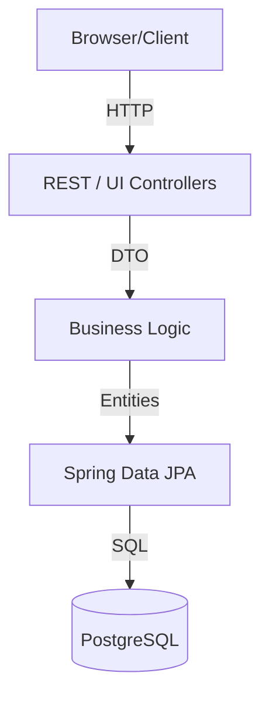
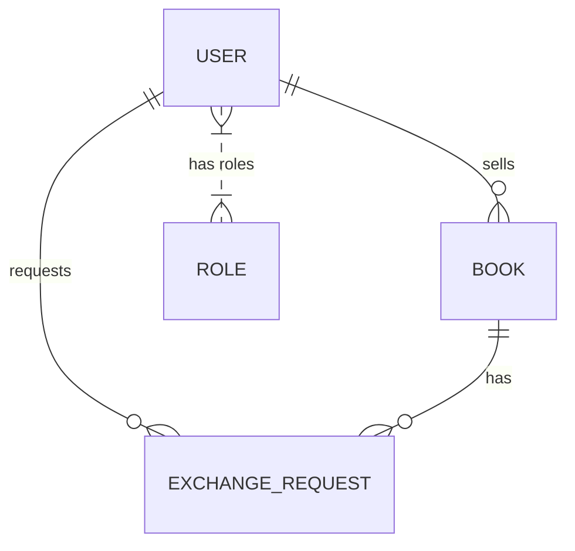

# BOIMELA: Book Exchange Platform


## Overview
**BOIMELA** is a full-stack web application designed for a Software Engineering Lab Project. It offers a structured and secure marketplace for users to exchange and sell books. Built with a highly scalable Java Spring Boot backend, Thymeleaf server-side rendered UI, and robust Spring Security, it models a real-world e-commerce architecture. 

The application is fully containerized and features seamless CI/CD delivery configured for the **Render** cloud platform.

## Features
- **Secure Authentication:** User registration and login utilizing Spring Security (BCrypt hashing, Role-based Access Control).
- **Role System:** Distinct permissions separating standard `BUYER` roles and elevated `SELLER`/`ADMIN` capabilities.
- **Book Marketplace:** 
  - Sellers can list, manage, and delete books.
  - Buyers can explore available books on the platform and initiate exchange/purchase requests.
- **Order Management:** Sellers receive and manage incoming purchase requests (Accept / Reject flows).
- **Automated CI/CD:** Github Actions pipeline configured for regression testing and continuous deployment on Render.
- **Containerization:** Built-in multi-stage `Dockerfile` and `docker-compose.yml` for isolated deployment and database provisioning.

## Technology Stack
- **Backend Framework:** Spring Boot 3.2.4
- **Database:** PostgreSQL (with H2 for isolated Integration Tests)
- **ORM:** Spring Data JPA / Hibernate
- **Frontend Layer:** Thymeleaf, HTML5, CSS3
- **Security:** Spring Security 6
- **Build Tool:** Maven
- **Containerization:** Docker & Docker Compose
- **Cloud Deployment:** Render (Infrastructure as Code via Blueprint)

## Architecture Overview

### MVC and Layered Architecture


### Entity Relationship Model


## Running the Application Locally
You can easily spin up the application and an isolated PostgreSQL database using Docker Compose.

1. Ensure [Docker](https://www.docker.com/) is installed and running.
2. Clone this repository and navigate into the `BOIMELA` directory.
3. Start the application:
   ```bash
   docker compose up --build
   ```
4. Wait for the Spring context to initialize. The platform will be mapped to `http://localhost:8080`.
5. Access the application directly in your browser.

## Deployment to Render

This repository is strictly configured to use **Render's Native Continuous Deployment** system via Infrastructure as Code (`render.yaml` Blueprint).

### Fully Automated Setup
1. Fork or clone this repository to your GitHub account.
2. Log into the [Render Dashboard](https://dashboard.render.com).
3. Click on the **New +** button and select **Blueprint**.
4. Connect the web application to your GitHub repository.
5. Render will automatically parse the `render.yaml` file located in the root of the project.
6. The web-service and its deployment hooks will be completely auto-provisioned using the pre-configured Internal PostgreSQL credentials.

The `render.yaml` controls the variables injected to the Docker container handling the app execution, preventing the need for manual configuration.

## Testing Execution
This application employs a strong testing strategy including both structural `UnitTests` leveraging Mockito to test isolated Service rules, and full context `IntegrationTests` utilizing an automatically configured H2 internal DB.

To execute the test suite (requires Maven):
```bash
mvn clean test
```
The GitHub Actions workflow enforces test completion before triggering Deployments to Render.
