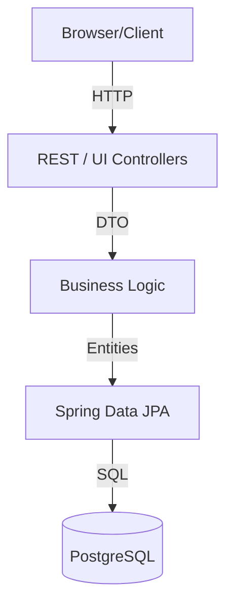
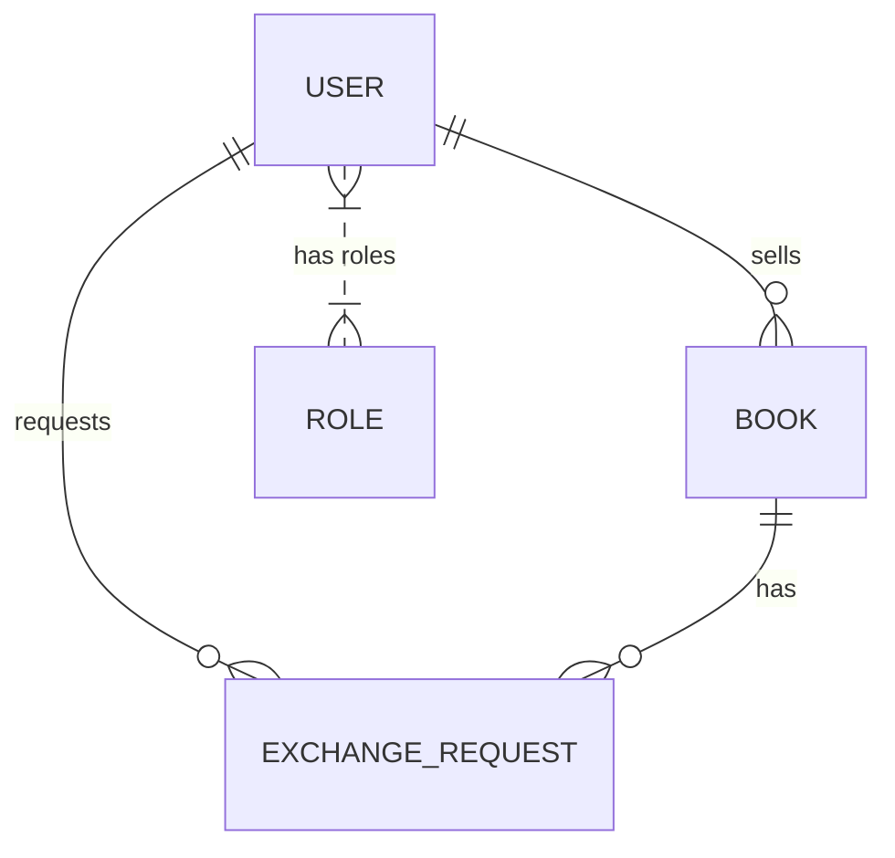

# Book Exchange Platform (BOIMELA)

## Overview
A complete Book Exchange Platform web application using Spring Boot, Thymeleaf, PostgreSQL, Docker, and GitHub Actions CI/CD to meet all lab project requirements.

## Architecture Layer Diagram


## Entity Relationship (ER) Diagram


## REST API Endpoints
- **Application Flow**
  - `/login` : Web UI for authentication (Thymeleaf)
  - `/register` : Web UI for user signing up (Thymeleaf)
  - `/dashboard` : Discover available books to exchange (Thymeleaf)
- **Auth API (`/api/auth`)**:
  - `POST /api/auth/signup` - User Registration
- **Books API (`/api/books`)**:
  - `GET /api/books` - Get all books
  - `GET /api/books/{id}` - Get book by ID
  - `POST /api/books` - Add a new book (Requires SELLER or ADMIN role)
  - `DELETE /api/books/{id}` - Delete a book (Requires ADMIN role)
- **Exchange API (`/api/exchanges`)**:
  - `GET /api/exchanges` - Get all requests (Requires ADMIN)
  - `POST /api/exchanges` - Request an exchange (Requires BUYER or SELLER)
  - `PUT /api/exchanges/{id}/status` - Update request status (Requires SELLER or ADMIN)

## How to Run
1. Ensure Docker is installed on your local machine.
2. Navigate to the root directory `D:\BOIMELA` or wherever it was cloned.
3. Build and launch via Docker Compose:
   ```bash
   docker compose up --build
   ```
4. Access the application at `http://localhost:8080/login`.

## CI/CD Workflow
The project is set up with GitHub Actions CI/CD under `.github/workflows/deploy.yml`. 
1. **Continuous Integration**: Pushes to `main` branch trigger Maven test execution (15 unit tests, 3 integration tests).
2. **Continuous Deployment**: If tests pass successfully on the `main` branch, a webhook triggers deployment to **Render**.

### Note on Render Secrets
The Render deployment relies on you adding the `RENDER_DEPLOY_HOOK_URL` secret to your GitHub Repository settings to point to your configured Render application instance.
